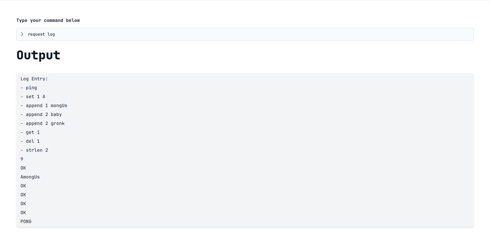

# 🪵 Raft Consensus Algorithm - IF3230-2024-081311555840 🪵

**Table of Contents**

- [🪵 Raft Consensus Algorithm - IF3230-2024-081311555840](#-raft-consensus-algorithm---if3230-2024-081311555840-)
- [📜 Description](#-description)
- [🕹️ Implemented Features](#️-implemented-features)
- [📚 Libraries](#-libraries)
- [🏃 How To Run](#-how-to-run)
- [🗒️ Acknowledgements](#️-acknowledgements)
- [🧑‍💻 Tasks](#-tasks)

## 📜 Description

Raft is a consensus algorithm designed as an alternative to the Paxos family of algorithms. It was meant to be more understandable than Paxos by means of separation of logic, but it is also formally proven safe and offers some additional features. Raft offers a generic way to distribute a state machine across a cluster of computing systems, ensuring that each node in the cluster agrees upon the same series of state transitions.

The following project implements a Raft consensus algorithm to ensure log consistency on a partitioned network. When applied, the log will be run on all state machines on different nodes. Furthermore, Raft consensus algorithm also ensures automatic leader election when a network partition happens over a long period of time.

The following diagram shows the overall design of this project.

## 🕹️ Implemented Features

1. Raft Consensus Algorithm:
   - Membership Change
   - Log Replication
   - Heartbeat
   - Leader Election
2. Web Client

## 📚 Libraries

The following library/packages are used in this project. No further action is needed as they are handled automatically by their respective package manager.

1. Frontend:

   - Flowbite Svelte

2. Backend:

   - Gorilla websocket
   - gRPC & Protobuf

Installing `protoc` and the `golang` compiler might be needed for modifying the protobuf file.

## 🏃 How To Run

1. Open 5+ seperate terminals and run the `raft-be/service/main.go` on each seperate terminal. Make sure to give unique IP and port for each process

2. Open another terminal and run the `raft-be/ambassador/main.go` file. Make sure to give a unique IP and port for the ambassador process.

3. Make a `.env` file on the `raft-fe` directory and change the host and port to match the ambassador's ip and port.

## 🗒️ Acknowledgements

This project was based on IF3230 Raft Consensus Algorithm Project

- Thanks to God
- Thanks to Mr. Achmad Imam Kistijantoro and Ms. Robithoh Annur as our lecturers
- Thanks to IF3230 assistants for creating and designing this project.

## 🧑‍💻 Tasks

| NIM      | Name                 | Tasks                          |
| -------- | -------------------- | ------------------------------ |
| 13520113 | Brianaldo Phandiarta | Protocol/gRPC Setup            |
| 13521054 | Wilson Tansil        | Front End                      |
| 13521065 | Mutawally Nawwar     | Ambassador Node Implementation |
| 13521082 | Farizki Kurniawan    | Project Setup                  |
| 13521092 | Frankie Huang        | Raft Consensus Algorithm       |
